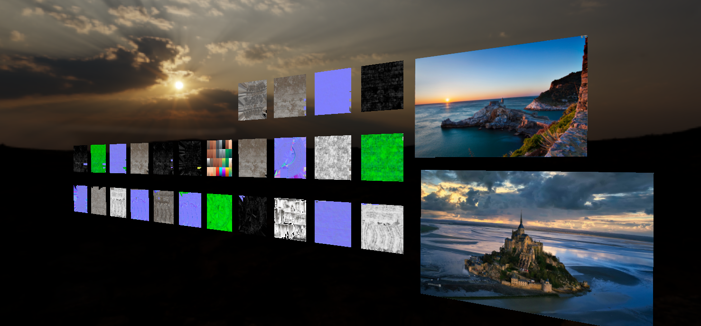
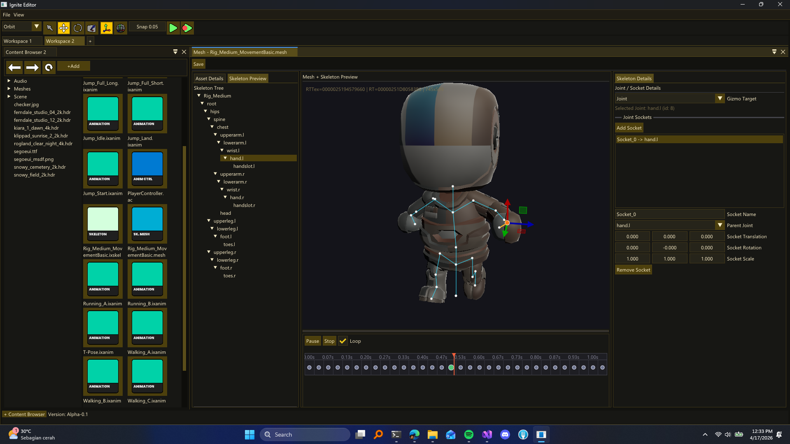

## Ignite Engine

Work in progress C++ Game Engine

### Preview

  
  
  
  
  

## MVP Roadmap

This roadmap is focused on the minimum feature set needed for a strong 3D gameplay foundation. The goal is to ship a fast renderer, a practical character animation pipeline, and editor tools that are usable from C# gameplay code.

### 1. Rendering Foundation

- [ ] Core rendering loop with device setup, swapchain handling, and frame lifecycle management
- [ ] Scene rendering for cameras, meshes, transforms, materials, and lighting
- [ ] Asset loading path for textures, meshes, shaders, and basic material data
- [ ] Performance baseline with GPU profiling, batching or instancing, and simple culling
- [ ] Debug rendering tools such as wireframe, bounds, and render stats

### 2. Animation Runtime

- [ ] Import and play skeletal animation clips
- [ ] Support skinning for animated meshes
- [ ] Root motion support for locomotion and character movement
- [ ] Animation blending for transitions, locomotion, and layered poses
- [ ] Animation montage system for one-off actions, interrupts, and event-driven sequences
- [ ] Animation events or notifies that can trigger gameplay and C# callbacks

### 3. Animation Editor Tools

- [ ] Clip preview with scrub timeline and playback controls
- [ ] Blend tree or animation graph editor for basic state-driven animation
- [ ] Montage editor with sections, slots, and event markers
- [ ] Skeleton and clip validation tools for import issues and retargeting checks
- [ ] Live preview in the editor viewport

### 4. C# Scripting Integration

- [ ] Expose renderer and animation APIs to C# scripts
- [ ] Allow scripts to control animation playback, blending, and montage triggers
- [ ] Allow animation events to call into C# gameplay logic
- [ ] Add hot reload support for scripts where practical
- [ ] Keep the scripting API stable enough for gameplay prototype work

### MVP Exit Criteria

- [ ] A 3D scene renders at a stable frame rate with basic lighting and materials
- [ ] A skinned character can load, play, blend, and interrupt animations
- [ ] Designers can author basic animation behavior in the editor without code changes
- [ ] C# scripts can trigger animation states and respond to animation events

### Post-MVP Goals

- [ ] Add IK, additive layers, and pose caching
- [ ] Improve the animation graph editor with richer transitions and parameter editing
- [ ] Add animation compression and streaming for larger projects
- [ ] Add more advanced rendering features such as shadows, post-processing, and LOD
- [ ] Expand editor tooling for animation debugging and content iteration