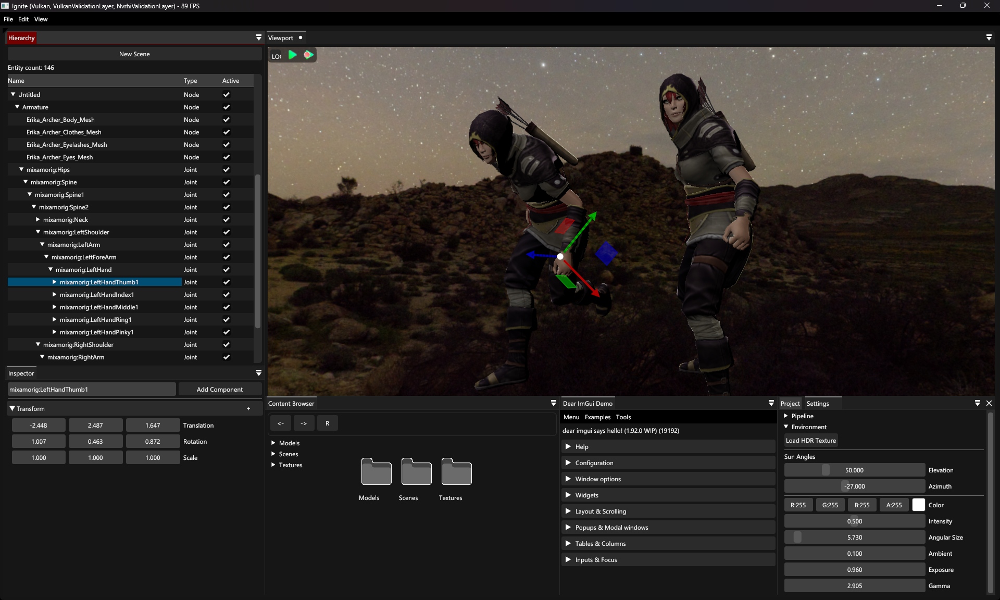
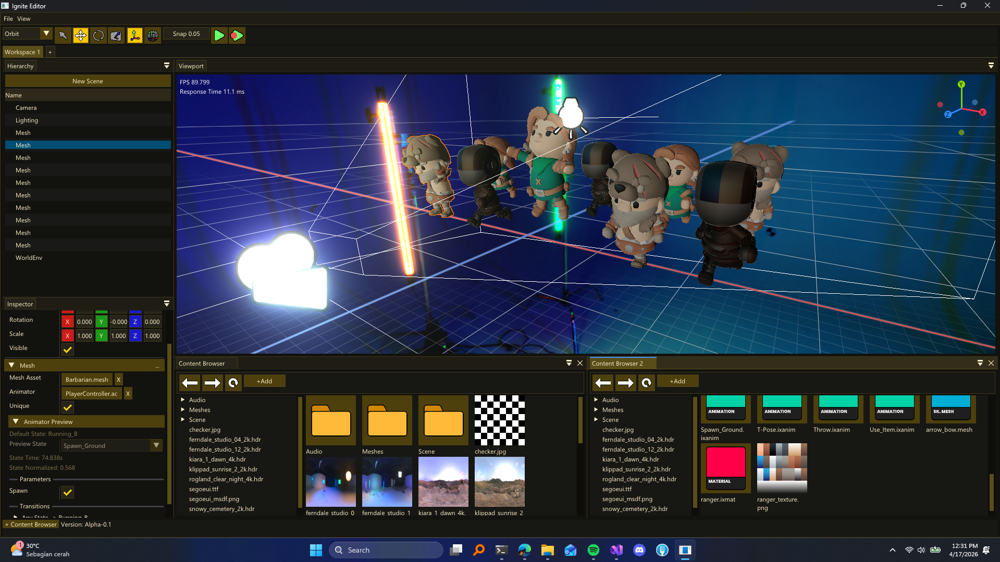

# Ignite Engine

Work in progress C++ Game Engine

## Installation

### Clone Repository Recursively

We actively develop on the `dev` branch. You can use `-b dev` when cloning the repository. <br>
```bash
git clone --recursively https://github.com/evangelionxyz/Ignite.git -b master
```

## Windows Build

Run Visual Studio Project Generator
```bash
gen.bat
```

## Linux Build

Run Make Generator.

Will automatically download dependencies
 ```bash
 sudo bash ./gen.sh
 ```


## Docker build

```bash
-------------------------------------------------------------
1. Build the image once (downloads FBX SDK, installs everything)
command: docker build -t ignite-dev .
-------------------------------------------------------------

-------------------------------------------------------------
2. Attach with source mounted
command: docker run -it --rm -v "${PWD}:/workspace" ignite-dev
-------------------------------------------------------------

-------------------------------------------------------------
3. Inside the container — generate makefiles and build
command: python3 scripts/setup.py
-------------------------------------------------------------

-------------------------------------------------------------
4. FBX_SDK already set, premake5 in PATH → instant
now, lets build.
-------------------------------------------------------------

-------------------------------------------------------------
5. Build
   5.1. This is C++ Project Build
        command: make -j6 config=debug Ignite.Editor

    5.2. We also need to build the C# Project
         command: make -j6 config=debug Ignite.ScriptEngine
```

## Preview

<div style='display:flex;flex-direction:column;width:80%;margin:auto; gap:12px'>
  
  
  
  
  
  
  
</div>